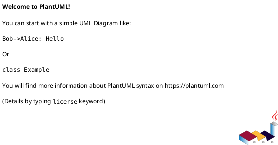

# 技术方案：<Epic 名称>

> 文档类型：Technical Design（Epic 级）  
> 适用目录：`docs/epics/<epic-id>-<slug>/`  
> Tech ID：`T-<领域>-<序号>`（与 Epic 对齐，例 `E-CMS-001` → `T-CMS-001`）  
> Epic ID：`E-<领域>-<序号>`  
> Epic 路径：`EPIC.md`（同目录）  
> 共享上下文：`shared-context.md`（同目录）  
> 全局共享上下文：`docs/epics/global-share-context.md`  
> 附件目录：`tech/`（同目录）  
> 覆盖 PRD：见 §0.1  
> 版本：v0.1  
> 状态：Draft / Ready / Implementing / Done  
> 作者：<研发负责人>  
> 日期：YYYY-MM-DD  
> 体系说明：`docs/README-PRD体系.md`  
> 设计定稿：`docs/superpowers/specs/<date>-<topic>-design.md`（按项目实际填写）  
> 迭代增量：见 §0.2；模版 `docs/template/技术方案增量模版.md`

---

## 0. 文档索引

### 0.1 覆盖的 PRD

| PRD ID | 标题 | 本方案覆盖范围（实现视角一句话） |
|--------|------|----------------------------------|
| P-xxx-01 | <标题> | <如：主数据表 + Console 创建/更新 API> |
| P-xxx-02 | <标题> | <…> |

### 0.2 迭代增量索引

> **全量本文** = 聚合后的权威契约。  
> **迭代变更细节**（字段/API/DDL/行为差集）写在 `TECH-DESIGN-delta-v{版本}-{kebab-slug}.md`，**勿**在全量 §0 堆长表。  
> 命名：与文首版本对齐；一份 delta 可覆盖多个 PRD。冲突时：**本文 + `tech/` > delta 摘要**。

| 版本 | 增量文档 | 覆盖 PRD | 一句话 | 状态 |
|------|----------|----------|--------|------|
| v0.1 | `TECH-DESIGN-delta-v0.1-<slug>.md` | P-xxx-01 | <摘要> | Draft |

无增量迭代时本表可空（首版全量即基线）。

### 0.3 附件清单

| 附件 | 路径 | 说明 |
|------|------|------|
| 领域模型 | `tech/domain.puml` | PlantUML 类图 / 包图 |
| 表结构说明 | `tech/ddl/schema.md` | 表清单、字段、索引；可附 `*.sql` |
| 时序图 | `tech/sequences/*.puml` | 主流程时序 |
| API 文档（可选） | `docs/api-doc/*.html` | 由 **backend-prototype 接口段** + `generate-api-doc` 导出；HTTP 字段级权威契约 |
| OpenAPI yaml（废弃） | — | **不再**维护 `tech/openapi/*.yaml` 作为契约 |
| 后端原型（可选） | 后端仓（按项目实际）`feature/<卡号>-…` | 见 **§7**：领域段（实体 + UseCase 接口）/ 接口段（API 接口 + SpringDoc）；**非**业务实现 |
| 迭代增量（可选） | `TECH-DESIGN-delta-v*.md` | 本轮变更视图；见 §0.2 |

> 字段级 HTTP 契约以 **API 接口 + SpringDoc 生成 HTML** 为准（见 §7）；无接口原型时 §5 列表仍可先写，细节待原型补齐。  
> Agent skill：`.agents/skills/epic-prd-tech-design-workflow/backend-prototype/SKILL.md`。  
> 迭代增量 skill 流程：`tech-design-author`（增量：先写 delta → 再合并全量）。

---

## 1. 目标与范围

### 1.1 目标

<从实现视角说明本 Epic 要建成的技术能力；勿复述 PRD 业务背景长文。>

### 1.2 In / Out

| 类型 | 内容 |
|------|------|
| In | <服务模块、库表、API、MQ、对接系统> |
| Out | <明确不做：如 C 端 UI、他服务内部实现、运维手册> |

### 1.3 与需求文档的分工

| 内容 | 权威来源 |
|------|----------|
| 跨 Epic 术语 / 已有能力 | `docs/epics/global-share-context.md` |
| 业务规则、字段语义、AC | PRD + `shared-context.md` |
| 聚合边界、表、API path、时序、复用（聚合后） | **本文 + `tech/`** |
| 本迭代相对基线的变更清单 | `TECH-DESIGN-delta-v*.md`（见 §0.2） |

冲突时：停止实现，先裁定文档（见体系说明「冲突裁定」）。

---

## 2. 相关上下文（复用与依赖）

> 写清「站在谁的肩膀上」；避免重复造轮子。每条尽量给到可定位的模块/类/文档路径。  
> 跨 Epic 已有能力须与 `global-share-context.md` 术语一致（例：`CouponStock`，勿写 `CouponBatch`）。

### 2.1 必须复用的已有能力

| 能力 | 所在模块 / 路径 | 复用方式 | 备注 |
|------|-----------------|----------|------|
| <例：统一 Audit Log> | `<module>` | 调用 / 扩展 / 配置 | <约束> |
| <例：CouponStock 优惠券批次> | 券域；见 global §2.1 | 选择引用 `CouponStockRef` | `G-R-001` |
| <例：消息订阅 notification> | `<service>` | 发 MQ / 查 API | subject 约定见 shared-context |

### 2.2 外部依赖与协作

| 依赖方 | 交互方式 | 契约 / 事件 | 失败策略 |
|--------|----------|-------------|----------|
| <例：notification> | MQ | 内容已发布 | 重试 / 告警 / 补偿 |
| <例：对象存储> | SDK | 上传返回 URL | — |

### 2.3 必读代码 / 文档

- `docs/epics/global-share-context.md` — 跨 Epic 术语
- `<path>` — <为什么读>
- 关联 PRD：`prds/...`
- 关联 shared-context：术语 / 枚举 / `E-R-xxx`；跨 Epic：`G-R-xxx`

### 2.4 明确不复用 / 新建的原因

| 点 | 原因 |
|----|------|
| <可选> | <与旧模型不兼容 / 边界不同> |

---

## 3. 领域模型

### 3.1 说明

- 聚合根：<名称>
- 主要实体 / 值对象：<列表>
- 与 `shared-context.md` §业务对象 的映射：<一句话；枚举码值不在此重定义>

### 3.2 PlantUML

源文件：[`tech/domain.puml`](tech/domain.puml)

> 约定：类名与代码/表意图一致；注明聚合边界；不画 UI 组件。

### 3.3 后端领域原型（可选，Phase 4）

> 经人确认后可跑 **backend-prototype 领域段**：在对应领域模块（按项目实际）**仅**落领域实体/数据结构 + UseCase **接口**签名；**禁止** UseCase Impl / Repository / ORM / 迁移脚本。  
> 完成后把分支与 path 回写 **§7**「领域模型 / UseCase 接口 paths」。细节与硬边界见 §7.0。

---

## 4. 数据库表设计

### 4.1 表清单

| 表名 | 说明 | 变更类型 | 关联聚合 / PRD |
|------|------|----------|----------------|
| `<t_xxx>` | <用途> | NEW / ALTER / DEPRECATED | <P-xxx / 聚合名> |

变更类型：

- **NEW**：新建表  
- **ALTER**：改字段/索引/约束  
- **DEPRECATED**：废弃（注明替代与下线计划）

### 4.2 详细设计

权威说明与 DDL：[`tech/ddl/schema.md`](tech/ddl/schema.md)（可附 `tech/ddl/*.sql`）。

正文要求：

- 主键、唯一键、关键索引  
- 与领域模型字段映射（实现名 ↔ 业务名）  
- 软删 / 审计字段策略（若统一走 Audit Log，表上勿重复造操作人字段，除非有只读投影需要）

---

## 5. API 列表

> 总览表；字段级契约以 **API 接口 / 生成 HTML** 为准（见 §7）。变更类型与备注供评审与差分阅读。  
> **MQ 事件监听**与 HTTP 同等计入本列表（见下方「事件监听」表）：每个跨服务协作事件一行。

### 5.x HTTP

| API Path | Method | 业务场景 | 变更类型 | 关联 PRD | 备注（主逻辑 / 变更内容） |
|----------|--------|----------|----------|----------|---------------------------|
| `/api/...` | GET | <场景> | 新增 | P-xxx | <鉴权、关键校验、调用下游> |
| `/api/...` | POST | <场景> | 修改 | P-xxx | <相对旧接口：改了什么> |
| `/api/...` | DELETE | <场景> | 移除 | P-xxx | <移除原因与替代接口> |

变更类型取值：**新增** / **修改** / **移除** / **已有**（仅文档补齐、行为不变时可用）。

填写约定：

- Path 含完整对外路径（含网关前缀若有约定）  
- 「业务场景」用产品语言，与 PRD 子场景可对上  
- 「备注」写实现要点，不写字段表（字段见 Controller / HTML）  
- **§5 与 Controller/HTML 冲突时，以 Controller/HTML 为准**，并回写本表

### 5.y 事件监听（MQ，计入 API 列表）

> 与 HTTP 同等对待。**Event Type** = CloudEvents `type`（schema）；Method 统一填 `MQ`。

| Event Type (schema) | Method | 业务场景 | 变更类型 | 关联 PRD | 生产者 → 消费者 | 备注（主逻辑） |
|---------------------|--------|----------|----------|----------|-----------------|----------------|
| `com.example.events.…` | MQ | <场景> | 新增 | P-xxx | `<app Publisher>` → `<app Listener>` | <幂等、软删/恢复、跳过条件> |

约定：

- 每个跨服务消费场景至少一行；仅生产不消费也要在备注写清「谁听」  
- 撤销/下线类事件须写明 **硬删 vs 软删**；若可再上线，写明 **恢复字段**（例 `deleted_at=null`）  
- Payload 字段级以 events-lib 事件类为准；时序图须引用本表 Event Type

---

## 6. 主要接口时序图

| 流程名 | 文件 | 对应 API / 场景 | 一句话 |
|--------|------|-----------------|--------|
| <发布活动> | [`tech/sequences/publish.puml`](tech/sequences/publish.puml) | POST …/publish | Console → 领域 → MQ → notification |
| <C 端详情> | [`tech/sequences/c-end-detail.puml`](tech/sequences/c-end-detail.puml) | GET …/{uuid} | 校验 PUBLISHED → 聚合读模型 → runtimeStatus |

约定：

- 参与者用真实边界：Controller / Application / Domain / Port / 外部系统  
- 标出同步调用与异步（MQ）  
- 异常路径可另图或在同一图用 `alt/else`

---

## 7. 后端原型与 API 详细设计（契约）

> **目标**：用最少代码把契约钉住，供 TECH / 评审对齐。  
> **不是**：功能实现、落库、联调、完整业务闭环。  
> **不再**手写 `tech/openapi/*.yaml` 作为权威契约。  
> Skill：`.agents/skills/epic-prd-tech-design-workflow/backend-prototype/SKILL.md`；导出文档见 `.agents/skills/generate-api-doc/SKILL.md`。

### 7.0 何时做、做什么

| 段 | 时机 | 产出 | 禁止 |
|----|------|------|------|
| **A 领域原型** | TECH Phase 4 可选；或用户明确「后端领域原型」 | domain 实体/VO/枚举等**数据结构**；UseCase **接口**（方法 + Command/Query） | UseCase Impl、Repository、ORM、迁移脚本、Controller 实现 |
| **B 接口原型** | TECH Phase 6 可选；或用户明确「后端接口原型 / 出 API 文档」 | API 层 Controller **接口** + SpringDoc 注解；DTO + `@Schema` | UseCase Impl、ORM Mapper/Entity 落库、任何实现类、完整 Audit/MQ 业务链路 |
| **正式实现** | 另开 writing-plans / executing-plans | Impl、持久化、迁移脚本（Liquibase 等按项目实际）、api-test | — |

触发约定：

- 用户只说「改原型 / 更新领域模型与 API」且未要求实现 → **默认只做 A+B 薄契约**，完成后停住，再问是否开实现计划。  
- 增量字段（例 P-xxx 加属性）：原型仍只改模型字段 + 接口/DTO 签名；**不要**顺手改 `*UseCaseImpl` / `*RepositoryImpl` / ORM 实体 / 迁移脚本。  
- 前后端同卡：**同名** feature 分支；后端仓（按项目实际）：`feature/<卡号>-<slug>`（自 `origin/develop` 等主干拉出）。

### 7.1 原型契约索引（必填或标明「未做」）

| 项 | 值 |
|----|-----|
| 后端仓库 | （项目实际仓库名） |
| 分支 | `feature/<卡号>-…`（无原型则填「未做」） |
| 归属模块 | （按项目实际模块名） |
| 领域实体 / UseCase 接口 paths | 段 A：按项目实际 |
| API 接口 paths | 段 B：`…/XxxController.java` 列表（按项目实际） |
| DTO / `@Schema` paths | 可选 |
| API 文档 HTML | `docs/api-doc/<app>-…-YYYYMMDD.html`（未导出则空，按项目实际） |
| 状态 | 未做 / Draft（接口已定义） / 已导出（有 HTML） |
| 范围说明 | **原型仅契约；业务 Impl / DDL 落地另开实现任务** |

### 7.2 允许 vs 禁止（摘要）

| ✅ 允许 | ❌ 禁止（除非用户明确要求完整实现） |
|---------|--------------------------------------|
| 领域实体 / VO / 枚举数据结构；UseCase 接口签名 | UseCase **Impl**（含改已有 Impl 接新字段） |
| API 接口 + SpringDoc 注解；DTO `@Schema` | Repository / ORM Entity·Mapper·XML |
| 纯数据结构的极薄校验占位（如静态工厂参数非空） | **任何实现类**（含 stub 壳）；迁移脚本 / 生产库 ALTER（DDL **草稿**仍写在 `tech/ddl/`，不在本原型 skill 落生产脚本） |
| 可选：LOCAL `springdoc.paths-to-match` + `generate-api-doc` | 为「跑通」补全装配、业务级测试绿、Audit/MQ 完整链路 |

### 7.3 HTTP 契约约定

- 字段 / 错误示例以 Controller 注解与生成 HTML 为准  
- `operationId` / `@Operation` 描述可写关联 `P-xxx`  
- **§5 与 Controller/HTML 冲突 → 以 Controller/HTML 为准**，回写 §5  
- 无接口原型时：§5 列表仍须齐全；字段级细节在 §7 标明「待接口原型」

### 7.4 例外与非 HTTP 契约

| 类型 | 说明 |
|------|------|
| MQ 事件 | **优先写入 §5.y 事件监听表**（计入 API 列表）；此处可摘要 Topic / 失败策略；事件类 path 可写 events-lib |
| 内部 Port / UseCase | 方法级契约短表；**领域段原型** path 写入 §7.1「领域模型 / UseCase 接口 paths」 |
| Scheduler / 其它非 HTTP | 在 §5 有对应行或本节说明；勿仅埋在实现里 |

### 7.5 主要 schema / 错误码索引（可选）

> 有接口原型或已导出 HTML 时填写；否则可留空并链到 HTML。

| Schema / code | 用途 |
|---------------|------|
| `<DTO 名>` | <请求/响应用途；关联 P-xxx> |
| `<业务码>` | <HTTP + 场景一句话> |

---

## 8. 前端对接要点

> 不写页面结构与样式；只写调用方必须知道的约定。若 Epic §0.2 / PRD §14 已有原型，可链分支与 path。

| 项 | 说明 |
|----|------|
| 鉴权 | <Console 权限码 / C 端网关 / 预览凭证> |
| 关键 ID | <对外一律 uuid；禁止依赖内部自增 id> |
| 关键错误码 | <码 → 用户可理解含义> |
| 预览 vs 正式 | <两套 path；可见性差异> |
| 联调环境 | <proxy / ApiConf 指向的 app 名> |
| 前端原型（可选） | <Epic §0.2 分支 / path> |

---

## 9. 风险与待决

| 编号 | 项 | 影响 | 状态 |
|------|----|------|------|
| OPEN-001 | <例：subject 枚举字面量未与 notification 对齐> | 订阅联调 | Open / Resolved |

---

## 10. AI 实现提示

1. 读取顺序：`EPIC.md` → `shared-context.md` → **本 TECH-DESIGN** → 相关 **`TECH-DESIGN-delta-v*`**（若本任务属某迭代）→ 相关 PRD → `tech/` 附件。
  
2. 不发明未在 PRD / shared-context 出现的业务规则；实现名可与业务名映射，但语义不得漂移。  
3. **区分原型与实现**：未明确「完整实现 / 写 Impl」时，TECH Phase 4/6 仅可跑 **backend-prototype**（§7.0）；勿把「更新领域模型 / API」做成端到端落地。  
4. 改 API：先改 API 接口 / SpringDoc（及导出 HTML）与 §5 列表并回写 §7.1，再另开任务写业务 Impl。  
5. 改表先改 `tech/ddl/`，再生产迁移脚本（Liquibase / Flyway 等按项目实际；原型阶段不写生产脚本）。  
6. 领域模型与代码包结构冲突时，以已评审的 `domain.puml` 为讨论基线并回写。  
7. 分支命名遵循工作区 Git 约定；前后端同卡同分支名。

---

## 11. 质量门禁（Ready）

- [ ] Tech ID / Epic 回链 / 覆盖 PRD 列表完整  
- [ ] §2 复用与依赖可定位到模块或文档  
- [ ] `tech/domain.puml` 可渲染，聚合边界清晰  
- [ ] `tech/ddl/schema.md` 表清单与变更类型齐全  
- [ ] §5 API 列表齐全（含 **事件监听 MQ 表**）；若有原型则 HTTP 与 API 接口 / HTML path 一致  
- [ ] 主流程时序图覆盖关键写路径与至少一条读路径  
- [ ] §7：**未做** / Draft / 已导出 三态之一已标明；若做过原型则 §7.1 分支与 paths 可定位，且写明「原型仅契约」  
- [ ] §8 前端对接要点足以联调  
- [ ] 无「业务规则写在技术方案、PRD 未定义」的泄漏  
- [ ] 无把 backend-prototype 误当成已完成业务实现（§7.2 边界） 
